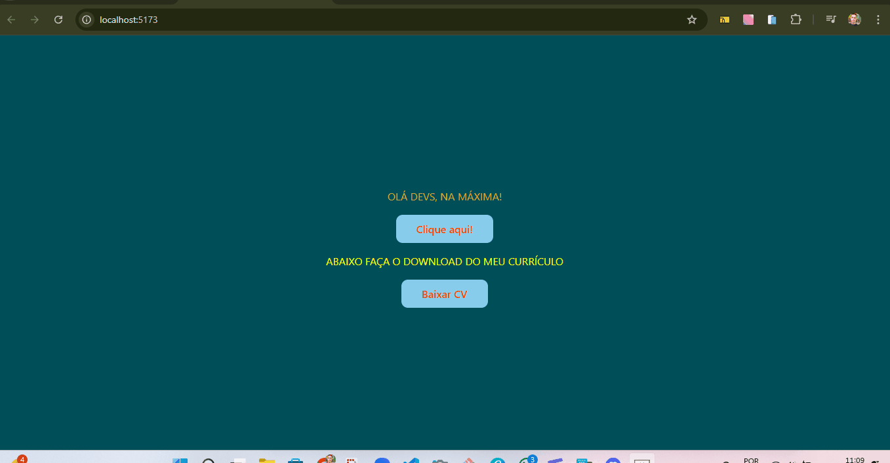

# Matheus Correia - Quest React Base

Esse projeto faz parte do Curso DevQuest do modulo de React Básico, e foi pedido para usar o Vite nesse projeto de React

## Visão Geral

### Captura de Tela

## Meu Processo

### Construído com

- HTML5 
- CSS3
- JavaScript
- React
- Vite
